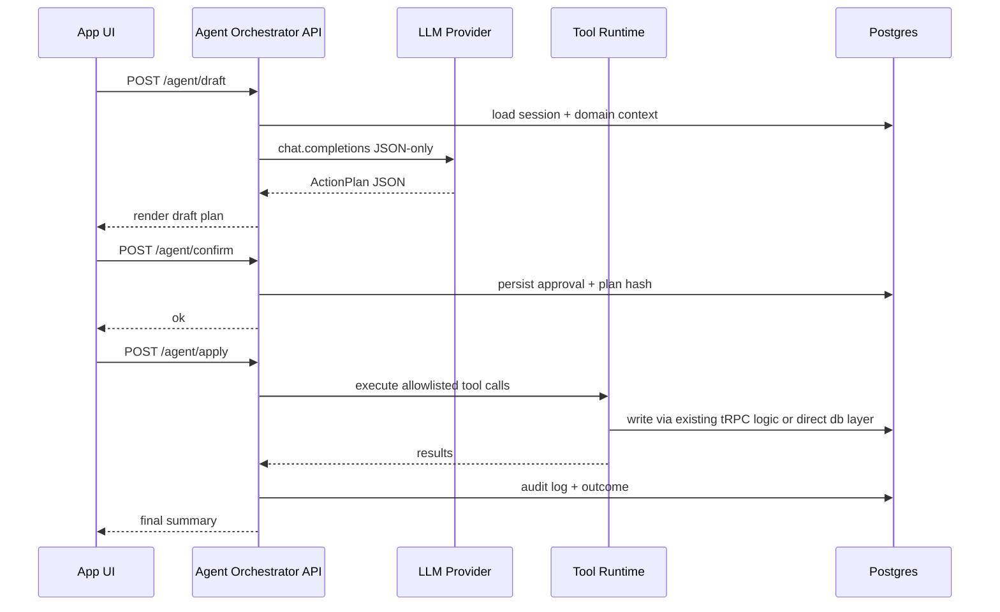

# Agent suite + tool plan (KAIROS)

This plan defines (1) which agents to build for this repo and (2) the **tools** they can use, under the constraint you set: **a new server-side Agent Orchestrator API** enforces **draft → confirm → apply** and writes an **audit trail**; agents never call raw tRPC mutations directly.

> Repo anchors for context:
> - Events entrypoint page is [`src/app/publish/page.tsx`](src/app/publish/page.tsx:1).
> - API surface is tRPC via [`src/app/api/trpc/[trpc]/route.ts`](src/app/api/trpc/[trpc]/route.ts:1) and router mounts in [`src/server/api/root.ts`](src/server/api/root.ts).

---

## 0) Architecture overview (where agents live)

### Key idea
- Agents are **LLM personas** running on the server.
- Tools are **server-side functions** exposed only through an **Agent Orchestrator**.
- The orchestrator is the only component that can:
  - call the LLM
  - execute tools
  - enforce allowlists
  - persist state + audit logs
  - require confirmation before apply

### Lifecycle
1. **Draft phase**: agent reads context via read-only tools and returns a structured **ActionPlan** (no side effects).
2. **Confirm phase**: UI shows the plan, user confirms.
3. **Apply phase**: orchestrator executes a deterministic set of tool calls based on the approved plan and logs results.

### Mermaid sequence (high-level)

---

## 1) Proposed agent suite (5 agents)

These map to the repo’s existing domains: projects/tasks/notes/events/chat/orgs.

### A1) Workspace Concierge Agent
**Goal:** help users navigate KAIROS and answer questions about their workspace (projects, tasks, collaborators, org membership, notifications).

- Typical prompts:
  - What am I behind on this week?
  - Which projects have urgent tasks unassigned?
  - Summarize my org activity.

- Output:
  - Read-only summary + suggested next actions.
  - If user asks for changes, returns a draft ActionPlan for confirm/apply.

### A2) Task Planner Agent
**Goal:** translate natural-language goals into a clean task plan and optionally apply it (create/update tasks, set priorities/status, assign users).

- Typical prompts:
  - Break this project into tasks.
  - Reprioritize my backlog.
  - Create tasks from this chat.

- Special: produces explicit dependency ordering and acceptance criteria fields.

### A3) Notes Vault Agent
**Goal:** manage sticky notes safely, respecting note locking semantics.

- Typical prompts:
  - Create a note template for meeting notes.
  - Summarize unlocked notes.

- Security constraints:
  - Never requests or handles raw note passwords.
  - Locked note content requires explicit user-provided unlock flow outside the agent.

### A4) Events Publisher Agent
**Goal:** create and manage events in the publish/events feed.

- Typical prompts:
  - Draft an event announcement.
  - Schedule an event and share it.
  - Moderate comments.

- Closely aligned with UI entrypoint [`src/app/publish/page.tsx`](src/app/publish/page.tsx:1) and feed component [`src/components/events/EventFeed.tsx`](src/components/events/EventFeed.tsx:764).

### A5) Collaboration & Org Admin Agent
**Goal:** org membership ops and collaboration workflows.

- Typical prompts:
  - Invite someone, set role/capability.
  - Audit who can write to Project X.

- Constraints:
  - Always requires confirm/apply for membership or permission writes.

---

## 2) Tooling model (what tools exist and who can call them)

### Tool categories
- **Read tools**: safe; can be executed during Draft phase.
- **Write tools**: only executable during Apply phase and only if plan was confirmed.
- **Meta tools**: orchestration helpers (validation, diffing, hashing, summarization) that do not mutate business data.

### Hard rules
- Agents cannot call existing tRPC mutations directly.
- Agents cannot execute any write tool in Draft.
- Apply executes only tool calls present in the approved plan (by hash), with server-side re-validation.

---

## 3) Tool allowlist (initial version)

All tools below are **server-side only** and invoked by the orchestrator.

### 3.1 Read tools (Draft allowed)

1. `getSessionContext`
- Returns: userId, activeOrgId (if any), locale, feature flags.

2. `listProjects`
- Backed by existing project queries.
- Returns minimal fields: id, name, orgId, shareStatus, counts.

3. `getProjectDetail`
- Returns project + tasks summary + collaborators.

4. `listTasks`
- Filter by projectId/status/assignee/priority.

5. `getTaskDetail`
- Returns task + comments + recent activity.

6. `listNotesMetadata`
- Returns only note metadata (id, title, isLocked, updatedAt). No locked content.

7. `getNoteContentIfUnlocked`
- Returns content only if note is not locked (or already unlocked by app flow and flagged in server state).

8. `listEventsPublic`
- Uses existing event feed query semantics.

9. `getEventDetail`
- Returns event + engagement counts + comments.

10. `listOrganizations`
- Org memberships and roles/capabilities.

11. `listNotifications`
- Returns unread counts + recent notifications.

12. `searchUsersByEmail`
- Mirrors existing collaborator search pattern (see usage in [`src/components/projects/ProjectManagement.tsx`](src/components/projects/ProjectManagement.tsx:85)).

### 3.2 Write tools (Apply only)

1. `createProject`
2. `updateProject`
3. `addProjectCollaborator`
4. `removeProjectCollaborator`

5. `createTask`
6. `updateTask`
7. `updateTaskStatus`
8. `deleteTask`

9. `createNote`
10. `updateNote` (only for unlocked notes)
11. `deleteNote`

12. `createEvent`
13. `updateEvent`
14. `deleteEvent`
15. `addEventComment`
16. `deleteEventComment`
17. `setEventRsvp`
18. `toggleEventLike`

19. `createOrganization`
20. `joinOrganizationByAccessCode`
21. `inviteOrgMember`
22. `updateOrgMemberRoleOrCapabilities`
23. `removeOrgMember`

24. `markNotificationsRead`

### 3.3 Meta tools

1. `validateZod`
- Validates every tool input/output and every agent message.

2. `hashPlan`
- Generates a stable hash of the ActionPlan used as the approval key.

3. `redactSecrets`
- Removes any accidental secret-like strings from logs.

4. `rateLimitGuard`
- Prevents runaway loops.

---

## 4) JSON-only contract (agent I/O)

All agent responses must be a single JSON object. The orchestrator rejects any non-JSON response.

### 4.1 Common schema: ActionPlan
- Fields:
  - `intent`: string
  - `readQueries`: array of read-tool calls
  - `proposedChanges`: array of human-readable diffs (still JSON)
  - `applyCalls`: array of write-tool calls (but not executed until Apply)
  - `risks`: array
  - `rollback`: array of compensating actions

### 4.2 Execution policy
- Draft: only `readQueries` executed; `applyCalls` returned for confirmation.
- Apply: orchestrator re-validates all `applyCalls` and runs them in order, aborting on first error, logging all results.

---

## 5) Repo-specific safety constraints

1. Authn/Authz
- Orchestrator uses the same session context as tRPC (see [`src/server/api/trpc.ts`](src/server/api/trpc.ts:32)).
- Every tool checks:
  - user is authenticated
  - user has access to org/project/note/event target

2. Notes locking
- No tool may reveal locked note content.
- Note updates require server to confirm note is unlocked.

3. Events moderation
- Comment deletes and event deletes must check author or org/admin capability (mirror the router logic).

4. Idempotency
- Each apply run stores an idempotency key = `planHash + userId`.

---

## 6) Implementation outline (what to build next)

### New modules (suggested)
- `src/server/agents/orchestrator.ts` (core)
- `src/server/agents/schemas.ts` (Zod contracts)
- `src/server/agents/tools/*` (tool implementations)
- `src/server/agents/audit.ts` (write audit)
- `src/app/api/agent/*` (draft/confirm/apply endpoints)

### Persistence (suggested new tables)
- `agentRuns` (draft/apply executions)
- `agentApprovals` (planHash + user approval)
- `agentToolCalls` (tool call log)

---

## 7) Open questions to lock before coding

- Whether to integrate agent UI into:
  - chat page [`src/app/chat/page.tsx`](src/app/chat/page.tsx:11)
  - project chat component [`src/components/projects/ProjectChat.tsx`](src/components/projects/ProjectChat.tsx:1)
  - or a new global command palette.

- Whether the agent can read direct messages (privacy) or only project-scoped chat.
