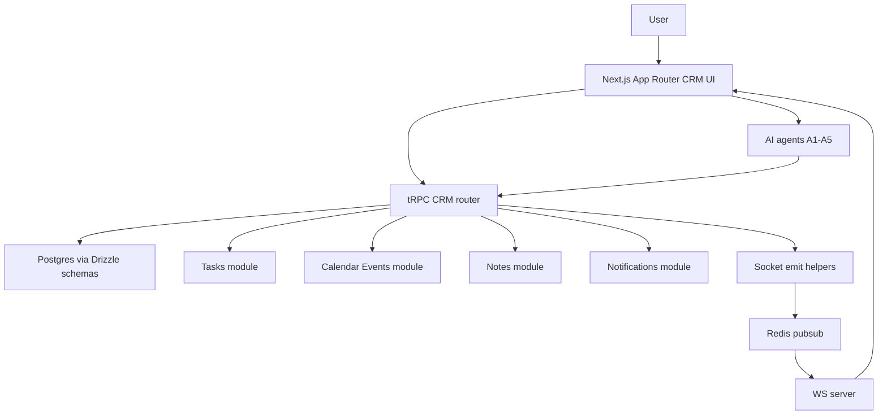

# KAIROS B2B Sales CRM — Full Implementation Plan (MVP → V1)

This document is an actionable implementation plan for integrating the proposed B2B Sales CRM into KAIROS (Next.js App Router + tRPC + Postgres/Drizzle + Socket.IO + Redis pub/sub), based on [`docs/crm-research-and-spec-kairos.md`](docs/crm-research-and-spec-kairos.md).

## 0) Goals, non-goals, and assumptions

### Goals

- Deliver a CRM module that is **activity-first** and **composes** with existing KAIROS modules: **tasks**, **calendar/events**, **notes**, **notifications**, **organizations**, **permissions**, and **real-time**.
- Prioritize **speed of use**, **data hygiene**, and **auditability** (including for AI/agent-initiated changes).
- Provide a coherent, scalable foundation for: pipeline management, deal progression, activities timeline, forecasting, and import/export.

### Non-goals (explicitly out of scope for MVP)

- Two-way email ingestion/sync (planned later).
- Two-way calendar sync with Google/Microsoft (planned later; MVP uses existing KAIROS calendar/events module and links).
- Field-level security and Postgres RLS (planned later).
- Enterprise CPQ, multi-currency pricing, advanced territory routing, and external search engines.

### Key assumptions (confirmations)

- **Record visibility for MVP**: **owner-based** visibility for CRM records; **org admins can see all**. No manager reporting hierarchy in MVP.
- CRM is **org-scoped** (not workspace-scoped), aligning with sales org behavior; workspaces can remain a UI filter later.
- KAIROS IDs are currently mixed: `users.id` is string, many domain tables are `integer` identity. CRM follows existing conventions: numeric identity for CRM tables; `ownerUserId`/`createdById` as string referencing `users.id`.

---

## 1) Product requirements (MVP and V1)

### 1.1 MVP requirements (must-have)

#### Core objects

- Accounts: create/update, list, search, view detail.
- Contacts: create/update, list/search, linked to accounts.
- Leads: create/update, list, status lifecycle; basic conversion.
- Deals: create/update, list, pipeline + stage; key fields (amount, close date, forecast category).
- Pipelines + stages: single default pipeline per org; stage ordering + probability.

#### Activity-first timeline

- Unified timeline on Account/Deal pages, showing:
  - CRM activities (calls/emails/manual notes)
  - Linked KAIROS **tasks** (follow-ups)
  - Linked KAIROS **calendar/events** (meetings)
  - Linked KAIROS **notes** (optional: mirrored as activity)
  - Stage changes, assignment changes
- One-click: create follow-up **task** from a deal or from an activity.

#### Hygiene

- Every open deal should have `nextActivityAt` (soft enforcement in MVP: warnings and dashboards).
- “Stale deals” view: no activity within N days or close date overdue.

#### Forecasting (MVP)

- Pipeline forecast for a date range:
  - stage-weighted forecast (amount × stage probability)
  - rollups by owner

#### Permissions (MVP)

- Org membership required.
- Owner-only access for CRM records by default.
- Org admins can view/edit all CRM records.
- “Private activity” visibility: private activities only visible to creator (+ admins).

#### Import/export (MVP)

- CSV import: accounts, contacts, leads, deals (separate flows).
- CSV export: same entities + optional activities.
- Import supports column mapping + dry-run validation.

### 1.2 V1 requirements (should-have)

- Multiple pipelines per org; pipeline types (new biz, renewal, upsell).
- Lead routing support (round-robin or rules)
- Forecast categories (Commit/BestCase/Pipeline/Omitted) + audit of changes.
- Approvals workflow for discounts/quote exceptions (minimal quote model).
- De-duplication suggestions (soft) for accounts by domain and contacts by email.
- Basic enrichment hooks (store snapshots separately).
- More reporting: activity volume, time-in-stage, conversion funnel.

---

## 1.3 User stories and acceptance criteria

The following stories reference existing KAIROS modules by name (tasks, calendar/events, notes, notifications, organizations, permissions).

### Accounts

**US-A1**: As a sales rep, I can create an account with a name + domain so I can track a company.
- Acceptance:
  - Creating an account requires `name`.
  - If `domain` exists, duplicates are detected and surfaced as a warning (no hard block in MVP).
  - Account appears in global CRM search by name/domain.

**US-A2**: As a rep, I can view an account detail page with a unified timeline.
- Acceptance:
  - Timeline includes CRM activities and linked KAIROS tasks/events/notes.
  - Timeline supports loading/empty/error states.

### Contacts

**US-C1**: As a rep, I can add a contact to an account with email so I can track stakeholders.
- Acceptance:
  - Contact can exist without an account (optional in MVP) but UI defaults to linking.
  - Duplicate email warning shown within the same org.

### Leads

**US-L1**: As a rep, I can create a lead and move it through statuses New → Working → Qualified.
- Acceptance:
  - Status transitions are recorded as activities on the lead timeline.
  - Lead list can be filtered by status and owner.

**US-L2**: As a rep, I can convert a qualified lead into an account + contact (+ optional deal).
- Acceptance:
  - Conversion produces:
    - new account/contact if no match
    - links to existing account by domain if selected
  - Conversion writes an activity referencing the created records.

### Deals

**US-D1**: As a rep, I can create a deal with pipeline, stage, amount, and close date.
- Acceptance:
  - Deal must be linked to an account.
  - Deal appears in pipeline board and list views.

**US-D2**: As a rep, I can move a deal between stages, and the timeline shows stage changes.
- Acceptance:
  - Each stage change generates a `StageChange` CRM activity.
  - Deal `lastStageChangedAt` updates.

**US-D3**: As a rep, I can create a follow-up task from a deal, and it appears on the deal timeline.
- Acceptance:
  - Creates a task in existing tasks module.
  - The created task is linked via `crm_activity` metadata (or a dedicated link table).

### Forecasting

**US-F1**: As a rep, I can see my weighted forecast for the current month.
- Acceptance:
  - Weighted forecast computed from open deals’ stage probabilities.
  - Filters for pipeline and date range.

### Import/export

**US-I1**: As an admin, I can import accounts from CSV with mapping and a dry-run.
- Acceptance:
  - Dry run shows row-level validation errors.
  - Import is idempotent by user-provided `externalId` or by `domain` if configured.

### Permissions and privacy

**US-P1**: As a rep, I cannot read or edit deals owned by another rep.
- Acceptance:
  - All read/write endpoints enforce owner/admin rule.
  - UI hides records I cannot access.

**US-P2**: As a rep, I can mark an activity as private.
- Acceptance:
  - Private activity is only returned to creator and admins.
  - Timeline counts and pagination remain consistent (private items are omitted).

---

## 2) Data model implementation plan (Drizzle/Postgres)

### 2.1 Conventions alignment

Observed KAIROS schema conventions (examples):

- `integer` identity PKs for most domain tables (e.g. [`src/server/db/schemas/tasks.ts`](src/server/db/schemas/tasks.ts:7)).
- User references are `varchar(...).references(() => users.id)` (e.g. [`src/server/db/schemas/notes.ts`](src/server/db/schemas/notes.ts:12)).
- Timestamp columns often use `created_at`/`updated_at` with defaults (mixed styles exist, but we should choose one and be consistent within CRM).
- Index naming style: `table_field_idx` (e.g. `task_assigned_to_idx`).

### 2.2 New schema files (suggested)

Create new Drizzle schema modules:

- [`src/server/db/schemas/crmAccounts.ts`](src/server/db/schemas/crmAccounts.ts)
- [`src/server/db/schemas/crmContacts.ts`](src/server/db/schemas/crmContacts.ts)
- [`src/server/db/schemas/crmLeads.ts`](src/server/db/schemas/crmLeads.ts)
- [`src/server/db/schemas/crmPipelines.ts`](src/server/db/schemas/crmPipelines.ts)
- [`src/server/db/schemas/crmDeals.ts`](src/server/db/schemas/crmDeals.ts)
- [`src/server/db/schemas/crmActivities.ts`](src/server/db/schemas/crmActivities.ts)
- (optional) [`src/server/db/schemas/crmAuditLog.ts`](src/server/db/schemas/crmAuditLog.ts)
- (optional) [`src/server/db/schemas/crmImports.ts`](src/server/db/schemas/crmImports.ts)

Then update exports in:

- [`src/server/db/schemas/index.ts`](src/server/db/schemas/index.ts)
- Possibly relations in [`src/server/db/schemas/relations.ts`](src/server/db/schemas/relations.ts)

### 2.3 Tables (MVP)

Use `createTable` from [`src/server/db/schemas/enums.ts`](src/server/db/schemas/enums.ts) (as done in other schemas).

#### `crm_accounts`

Core columns:

- `id` int identity PK
- `organizationId` int FK → organizations (confirm exact organizations PK type in [`src/server/db/schemas/organizations.ts`](src/server/db/schemas/organizations.ts))
- `name` varchar(256) not null
- `domain` varchar(256) nullable
- `industry` varchar(128) nullable
- `sizeBand` varchar(64) nullable
- `revenueBand` varchar(64) nullable
- `ownerUserId` varchar FK → `users.id`
- `lifecycleStage` enum/text: Prospect/Customer/Churned (MVP can be text with constrained values)
- `source` text: manual/csv/integration
- `tags` (MVP: text[] or json) optional
- `createdAt`, `updatedAt`, `lastActivityAt`

Indexes:

- `(organizationId, name)` btree
- `(organizationId, domain)` btree, partial where domain not null
- `(organizationId, ownerUserId)` btree
- `lastActivityAt` for sorting recent

Constraints:

- Unique **soft** dedupe: do not enforce unique on domain at first; add a unique constraint later only if required.

#### `crm_contacts`

- `id` int identity PK
- `organizationId` int
- `accountId` int nullable FK → `crm_accounts.id`
- `firstName`, `lastName` varchar
- `title`, `department` varchar
- `email` varchar(320) nullable
- `phone` varchar(64) nullable
- `linkedinUrl` text nullable
- `ownerUserId` varchar FK → users.id
- `status` text: Active/Inactive
- `createdAt`, `updatedAt`, `lastActivityAt`

Indexes:

- `(organizationId, accountId)`
- `(organizationId, email)` for lookup/dedupe warnings
- `(organizationId, ownerUserId)`

#### `crm_leads`

- `id` int identity PK
- `organizationId` int
- `ownerUserId` varchar nullable (supports unassigned leads)
- `fullName` varchar
- `email`, `phone` varchar
- `companyName`, `companyDomain`
- `source` text
- `status` text: New/Working/Qualified/Disqualified
- `disqualifyReason` text nullable
- `score` int nullable
- `createdAt`, `updatedAt`, `lastTouchedAt`
- Conversion: `convertedAt`, `convertedAccountId`, `convertedContactId`, `convertedDealId`

Indexes:

- `(organizationId, status, updatedAt)`
- `(organizationId, ownerUserId, status)`
- `(organizationId, email)`

#### `crm_pipelines`

- `id` int identity PK
- `organizationId` int
- `name` varchar(128)
- `type` text: NewBiz/Renewal/Upsell
- `isDefault` boolean
- `createdAt`, `updatedAt`

Indexes:

- `(organizationId, isDefault)`
- `(organizationId, name)` unique (optional)

#### `crm_stages`

- `id` int identity PK
- `pipelineId` int FK
- `name` varchar(128)
- `order` int
- `probability` numeric(3,2) or int basis points
- `isClosedWon` boolean
- `isClosedLost` boolean
- `exitCriteria` text

Indexes:

- `(pipelineId, order)` unique

#### `crm_deals`

- `id` int identity PK
- `organizationId` int
- `accountId` int not null
- `primaryContactId` int nullable
- `name` varchar(256)
- `ownerUserId` varchar not null
- `pipelineId` int
- `stageId` int
- `forecastCategory` text: Pipeline/BestCase/Commit/Omitted (MVP can default to Pipeline)
- `amount` numeric(12,2)
- `currency` varchar(3) default org currency
- `closeDate` date/timestamp
- `nextActivityAt` timestamp nullable
- `lastStageChangedAt` timestamp
- `createdAt`, `updatedAt`, `lastActivityAt`
- Loss fields: `closedLostReason` text, `competitor` text

Indexes:

- `(organizationId, ownerUserId)`
- `(organizationId, pipelineId, stageId)` for pipeline board queries
- `(organizationId, closeDate)` for forecasting
- `(organizationId, nextActivityAt)` for hygiene
- `(accountId)` for account rollups

#### `crm_activities`

This is the normalization layer and timeline backbone.

Columns:

- `id` int identity PK
- `organizationId` int
- `type` text: Call/Email/Meeting/Note/Task/StageChange/Approval/QuoteSent/etc.
- `occurredAt` timestamp (when it happened)
- `createdAt` timestamp (when logged)
- `createdByUserId` varchar
- `assignedToUserId` varchar nullable
- `accountId` int nullable
- `contactId` int nullable
- `dealId` int nullable
- `leadId` int nullable
- `subject` varchar(256) nullable
- `body` text nullable
- `externalRef` varchar(256) nullable
- `metadata` jsonb nullable
- `visibility` text: Private/Org (MVP) or Private/Team/Org

Indexes:

- `(organizationId, occurredAt desc)`
- `(dealId, occurredAt desc)`
- `(accountId, occurredAt desc)`
- `(contactId, occurredAt desc)`
- `(leadId, occurredAt desc)`
- `(createdByUserId, occurredAt desc)`

Linking to existing KAIROS modules:

- Task link: `metadata.taskId` referencing tasks module (see [`src/server/db/schemas/tasks.ts`](src/server/db/schemas/tasks.ts:7)).
- Meeting link: `metadata.calendarEventId` referencing calendar/events module.
- Note link: `metadata.noteId` referencing notes module (see [`src/server/db/schemas/notes.ts`](src/server/db/schemas/notes.ts:28)).

Design choice for linking:

- MVP: store integer IDs in `metadata` (simple).
- V1: introduce explicit join tables for enforceable FKs:
  - `crm_activity_tasks(activityId, taskId)`
  - `crm_activity_events(activityId, eventId)`
  - `crm_activity_notes(activityId, noteId)`

#### (Optional) `crm_audit_log`

Append-only compliance log for sensitive field edits and agent actions.

- `id` int identity PK
- `organizationId` int
- `entityType` text (Account/Contact/Lead/Deal/Activity/Pipeline/Stage)
- `entityId` int
- `action` text (create/update/delete/merge/convert)
- `field` text nullable
- `oldValue` text nullable
- `newValue` text nullable
- `actorUserId` varchar
- `actorType` text: human/agent
- `requestId` varchar nullable
- `createdAt`

Indexes:

- `(organizationId, entityType, entityId, createdAt desc)`
- `(actorUserId, createdAt desc)`

### 2.4 Migrations strategy

- Create a single initial migration adding CRM tables.
- Seed default pipeline + stages for each org:
  - Prefer “seed on org creation” path later; for MVP, provide admin action to initialize CRM for an org.
- Add indexes in the same migration; measure and adjust after initial query patterns.

### 2.5 Search strategy (MVP)

- MVP search across accounts/contacts/deals via ILIKE + indexed fields.
- V1: introduce Postgres FTS:
  - Add `tsvector` computed columns for account/contact/deal names + emails.
  - Add GIN indexes.

---

## 3) API / tRPC router plan

### 3.1 Router structure

Add a new router module:

- [`src/server/api/routers/crm.ts`](src/server/api/routers/crm.ts)

Wire it into the app router in [`src/server/api/root.ts`](src/server/api/root.ts:16) as `crm: crmRouter`.

Optionally split by domain if it grows:

- [`src/server/api/routers/crm/accounts.ts`](src/server/api/routers/crm/accounts.ts)
- [`src/server/api/routers/crm/deals.ts`](src/server/api/routers/crm/deals.ts)
- etc.

### 3.2 Procedure design principles

- All procedures require authenticated session.
- Every read/write must enforce:
  - org membership
  - owner/admin visibility
  - private activity rules
- Inputs validated with zod.
- Pagination:
  - Use cursor-based pagination for timelines and lists where sorting is stable (e.g., by `occurredAt` then `id`).
- Search:
  - Provide lightweight endpoints: `search.global`, `accounts.search`, `contacts.search`, `deals.search`.

### 3.3 Proposed procedures (MVP)

Below list uses `crm.*` namespace in tRPC.

#### Accounts

- `crm.accounts.list`
  - input: `{ cursor?, limit?, ownerOnly?: boolean, query?: string, tags?: string[] }`
  - output: `{ items: AccountSummary[], nextCursor? }`
- `crm.accounts.getById`
  - input: `{ id }`
  - output: full account + rollups (deal count, last activity)
- `crm.accounts.create`
- `crm.accounts.update`
- `crm.accounts.delete` (V1; MVP can avoid hard delete)

#### Contacts

- `crm.contacts.list` (filters: accountId, query)
- `crm.contacts.getById`
- `crm.contacts.create`
- `crm.contacts.update`

#### Leads

- `crm.leads.list` (filters: status, owner)
- `crm.leads.getById`
- `crm.leads.create`
- `crm.leads.update`
- `crm.leads.convert`
  - input: `{ leadId, accountMatch?: { accountId } | { create: { name, domain } }, createDeal?: boolean }`
  - output: `{ accountId, contactId, dealId? }`

#### Pipelines + stages

- `crm.pipelines.list`
- `crm.pipelines.getDefault`
- `crm.pipelines.create` (admin-only)
- `crm.pipelines.update` (admin-only)
- `crm.stages.reorder` (admin-only)

#### Deals

- `crm.deals.list`
  - input: `{ pipelineId?, stageId?, ownerOnly?, closeDateRange?, query?, cursor?, limit? }`
- `crm.deals.getById`
- `crm.deals.create`
- `crm.deals.update`
- `crm.deals.changeStage`
  - input: `{ dealId, stageId, occurredAt?, note? }`
  - side effects:
    - creates `crm_activity` type StageChange
    - updates `lastStageChangedAt`
- `crm.deals.setNextActivity`
  - input: `{ dealId, nextActivityAt }`

#### Activities + timeline

- `crm.activities.create`
  - input: `{ type, occurredAt, subject?, body?, visibility, links?: { dealId?, accountId?, contactId?, leadId? }, metadata?: {} }`
- `crm.timeline.list`
  - input: `{ entity: { type: 'account'|'deal'|'contact'|'lead', id }, cursor?, limit?, filterTypes?: string[] }`
  - output: mixed list `TimelineItem[]`

Timeline composition plan (important):

- Phase 1: `crm_timeline` = CRM activities only.
- Phase 2: augment with linked tasks/events/notes by resolving IDs in `metadata`.
- Phase 3: true unified feed: query CRM activities plus join to tasks/events/notes without duplication.

#### Forecasting

- `crm.forecast.my`
  - input: `{ from, to, pipelineId? }`
  - output: `{ totalAmount, weightedAmount, byStage: [...], deals: DealSummary[] }`
- `crm.forecast.org` (admin) (V1)

#### Import/export

- `crm.import.prepare`
  - input: `{ entityType, csvText | fileRef, mapping }`
  - output: `{ jobId, validationErrors[], samplePreview[] }`
- `crm.import.apply`
  - input: `{ jobId, confirm: true }`
- `crm.export.request`
  - input: `{ entityType, filters }`
  - output: `{ downloadUrl | fileId }`

### 3.4 Inputs/outputs and types

- Define zod schemas near router.
- For list endpoints, return summary DTOs rather than raw Drizzle models.
- For timeline, define a discriminated union:
  - `kind: 'crmActivity' | 'task' | 'event' | 'note'`
  - each includes `occurredAt` and `actor` details

### 3.5 Error handling

- Use consistent tRPC errors:
  - `UNAUTHORIZED` if not logged in
  - `FORBIDDEN` if not owner/admin
  - `NOT_FOUND` if record not in org
- Add rate limits on import/export and AI apply actions (reuse existing rate limit infra if present).

---

## 4) UI/UX plan (Next.js App Router)

### 4.1 Information architecture and navigation

Add a top-level CRM area with sub-nav:

- `CRM`
  - Accounts
  - Contacts
  - Leads
  - Deals (pipeline board + list)
  - Activities
  - Forecast
  - Imports/Exports (admin)

Implementation suggestions:

- Add new routes under:
  - [`src/app/crm/page.tsx`](src/app/crm/page.tsx) (CRM home/dashboard)
  - [`src/app/crm/accounts/page.tsx`](src/app/crm/accounts/page.tsx)
  - [`src/app/crm/accounts/[id]/page.tsx`](src/app/crm/accounts/[id]/page.tsx)
  - [`src/app/crm/deals/page.tsx`](src/app/crm/deals/page.tsx)
  - [`src/app/crm/deals/[id]/page.tsx`](src/app/crm/deals/[id]/page.tsx)
  - etc.

Navigation link entry point in side nav:

- Update [`src/components/layout/SideNav.tsx`](src/components/layout/SideNav.tsx) to include `CRM`.

### 4.2 Key screens and states

#### CRM home dashboard

- “Today” view: my tasks due today (from tasks module), my meetings (from calendar/events), and at-risk deals.
- KPIs: open deals count, weighted pipeline this month, stale deals count.

States:

- Empty: show onboarding CTA: “Import your accounts” and “Create your first deal”.
- Loading: skeleton KPI cards and list placeholders.
- Error: retry + link to notifications/settings.

#### Accounts list

- Table with columns: Name, Domain, Owner, Last activity, Open deals.
- Search input (debounced).
- Filters: owner (me/all if admin), tags.

#### Account detail

Layout:

- Header: name + domain + owner + quick actions.
- Tabs:
  - Overview
  - Deals
  - Contacts
  - Timeline
  - Notes (integrate existing notes UI patterns)

Timeline:

- Unified feed with filter chips: All, Calls, Emails, Meetings, Tasks, Notes, Stage changes.
- Create actions:
  - Log call/email
  - Create follow-up task
  - Schedule meeting (goes through calendar/events module)
  - Add note (goes through notes module)

#### Deals pipeline board

- Kanban by stage (single pipeline MVP).
- Each card: deal name, amount, close date, next activity.
- Drag stage change:
  - optimistic UI update
  - create StageChange activity
  - handle failure rollback and toast

#### Deal detail

- Header: stage, amount, close date, forecast category.
- Timeline on right or under tabs.
- Hygiene widget: next activity date, “stale” warnings.

#### Leads list + conversion

- List by status; quick assign owner.
- Lead detail includes “Convert” wizard:
  - choose existing account or create new
  - create contact
  - optional create deal

#### Import/export (admin)

- CSV upload/textarea, mapping UI, validation preview.
- Apply requires explicit confirmation.
- Export produces downloadable CSV with audit log entry.

### 4.3 Component plan (suggested)

Create CRM UI components under:

- [`src/components/crm/`](src/components/crm/)

Suggested components:

- `CrmDashboardClient`
- `AccountsTable`
- `AccountHeader`
- `DealKanbanBoard`
- `DealCard`
- `Timeline/TimelineFeed`
- `Timeline/TimelineItem`
- `Forms/AccountForm`, `ContactForm`, `DealForm`, `LeadForm`, `ActivityForm`
- `Import/ImportWizard`

### 4.4 UX details

- Consistent toasts via existing toast provider.
- Empty states should educate (examples of data to enter).
- Use existing design system patterns; avoid inventing new UI primitives.

---

## 5) Permissions plan

### 5.1 Role mapping

KAIROS currently uses org roles: `admin`, `worker`, `mentor` (view-only) per [`src/lib/permissions.ts`](src/lib/permissions.ts:10).

CRM mapping for MVP:

- `admin` → CRM Admin (full access)
- `worker` → Sales Rep (create/read/update own CRM records)
- `mentor` → Read-only / Exec (view-only; cannot create/update)

V1 can introduce CRM-specific roles later, but MVP should reuse existing org roles.

### 5.2 Record visibility rules (MVP)

- Accounts/contacts/leads/deals:
  - Visible if `ownerUserId === session.user.id` OR user role is `admin`.
  - For contacts linked to owned accounts: visible if account is visible.
- Activities:
  - Must be visible by parent entity visibility AND
  - If `visibility === Private`: visible only to `createdByUserId` OR `admin`.

### 5.3 Enforcement points

- tRPC router procedures: enforce in every query/mutation.
- Shared helper functions:
  - add a CRM access helper module (plan-only): [`src/server/crm/access.ts`](src/server/crm/access.ts)
- UI:
  - hide actions for view-only roles
  - avoid leaking counts of forbidden records

### 5.4 Auditability

- All privileged actions (import/export, conversion, mass updates) write to `crm_audit_log`.
- Agent-initiated changes always log `actorType = agent`.

---

## 6) Integrations plan

### 6.1 CSV import/export MVP

Entities:

- Accounts, contacts, leads, deals.

MVP approach:

- Synchronous small imports (bounded rows) or background job for bigger files.
- Mapping UI:
  - map columns → known fields
  - default mapping by header names
- Validation:
  - required fields present
  - dates parseable
  - emails valid
  - domain normalized
- Idempotency:
  - support optional `externalId` column stored in `metadata.externalId` or explicit column

Exports:

- filterable by owner, date range, pipeline
- export is auditable (write audit log + notify user)

### 6.2 Email and calendar integration (later)

- Calendar:
  - V1: two-way sync; store provider event id; create activities for created/updated meetings.
- Email:
  - V1: ingest email metadata as activities; store bodies only under retention policy.

### 6.3 Background jobs

Use background job pattern consistent with existing infra (if no job runner exists, introduce one later).

Jobs needed:

- Import apply job (if async)
- Nightly hygiene job: recompute stale deals, update `lastActivityAt` rollups
- Notification fanout for due follow-ups

---

## 7) Real-time + notifications plan

### 7.1 Real-time event emission

KAIROS has a publisher-based socket pipeline via helpers in [`src/server/socket/emit.ts`](src/server/socket/emit.ts:1).

Add new emits (plan only):

- `crm:account:updated` (payload: `accountId`)
- `crm:deal:updated` (payload: `dealId`)
- `crm:deal:stageChanged` (payload: `dealId`, `fromStageId`, `toStageId`)
- `crm:activity:created` (payload: `activityId`, `entityRefs`)
- `crm:import:completed` (payload: `jobId`, `summary`)

Rooming strategy:

- User rooms for personal updates (owner only).
- Broadcast to org room (V1) if/when org-wide visibility exists.

### 7.2 Notifications

Use existing notifications table and emit helper; see [`src/server/db/schemas/notifications.ts`](src/server/db/schemas/notifications.ts:6) and emitter [`src/server/socket/emit.ts`](src/server/socket/emit.ts:66).

Trigger notifications (MVP):

- Assignment change (deal/lead owner changed) → notify new owner.
- Mentions in activity body (if mention parsing exists already) → notify mentioned user.
- Import completed → notify initiator.

Notification links:

- `/crm/deals/[id]`
- `/crm/accounts/[id]`
- `/crm/imports/[jobId]`

### 7.3 Optimistic UI

- Deals kanban drag:
  - optimistic stage update in client state
  - rollback on error
- Activity create:
  - optimistic append to timeline with temporary id
  - replace on server ack

---

## 8) AI agent integration plan

This plan reuses KAIROS agent patterns documented in [`docs/crm-research-and-spec-kairos.md`](docs/crm-research-and-spec-kairos.md) and existing agent orchestrator approach.

### 8.1 Agent responsibilities

#### A1 Workspace Concierge (read-only)

- “Pipeline health” summaries:
  - stale deals
  - deals missing next activity
  - risks in current period
- Must not write; only reads CRM + tasks + events + notes.

#### A2 Task Planner (writes tasks)

- From a deal context, propose follow-up tasks and sequences.
- Writes only to tasks module, then logs CRM activity referencing created task(s).

#### A3 Notes Vault (writes notes)

- Draft account research notes and meeting recaps.
- Writes to notes module; optionally logs a CRM activity referencing note id.

#### A4 Events Publisher (calendar/events)

- Schedule meetings linked to deal/contact.
- Writes to calendar/events module; logs CRM activity referencing event id.

#### A5 Org Admin

- CRM configuration admin assistant:
  - initialize default pipeline
  - stage definitions
  - import/export guidance

### 8.2 Tool boundaries and lifecycle

- Draft → Confirm → Apply is mandatory for:
  - lead conversion
  - deal stage/amount/close date updates
  - any import/merge

Separation of concerns:

- Agents propose changes as structured drafts.
- Server-side “apply” procedures execute writes after permission checks.
- Audit log is written on apply.

### 8.3 Optional CRM-specific agents (V1+)

- A6 Deal Desk: quote/approval drafts (strict confirmations)
- A7 Data Steward: dedupe/merge suggestions; bulk cleanup proposals

---

## 9) Testing plan

Align with existing tests structure under [`tests/`](tests/).

### 9.1 Unit tests

- Permission utilities:
  - owner/admin visibility for CRM entities
  - private activity visibility
- Timeline composition function:
  - ordering and filtering
  - pagination cursor correctness

### 9.2 Integration tests (tRPC + DB)

- CRUD for accounts/contacts/leads/deals
- Lead conversion transactional behavior
- Stage change produces activity
- Import dry-run validation
- Export audit log writes

### 9.3 E2E tests

- CRM navigation renders for allowed roles
- Create account → create deal → move stage → timeline updates
- Create follow-up task from deal and see it in timeline

### 9.4 Security tests

- Ensure forbidden access for non-owner
- Ensure view-only role cannot mutate
- Ensure private activity not visible to others
- Rate limit import/apply

### 9.5 Fixtures and test data

- Standard org with 2 users + one admin
- seed default pipeline + 4-6 stages
- sample deals across stages

---

## 10) Milestones, sequencing, risks, and rollout strategy

### 10.1 Sequencing (relative estimates)

Use relative sizing: S / M / L / XL.

1. Foundations (schemas + tRPC skeleton + nav) — **L**
2. Accounts/contacts/leads/deals CRUD + lists/search — **L**
3. CRM activities + timeline (CRM-only) — **M**
4. Link timeline to tasks/events/notes (unified feed) — **M**
5. Pipeline board (kanban) + optimistic stage changes — **M**
6. Forecasting MVP — **S**
7. CSV import/export MVP (dry-run + apply) — **L**
8. Notifications + real-time updates — **M**
9. AI agent integrations (draft/confirm/apply; logging) — **M**
10. Hardening: tests + performance + UX polish — **M**

### 10.2 Risks and mitigations

- **Data leakage across orgs**: mitigate via strict org scoping in every query + router security tests.
- **Timeline complexity** (mixing CRM activities with tasks/events/notes): mitigate via phased rollout; start CRM-only.
- **Import quality and dedupe**: mitigate with dry-run validation + warnings + externalId support.
- **Performance** on board/timeline queries: mitigate via indexes and cursor pagination; optionally add rollup columns.
- **Agent safety**: mitigate via draft/confirm/apply + audit log + rate limits.

### 10.3 Rollout strategy

- Gate CRM behind a feature flag:
  - `features.crmEnabled` (org-level)
- Start with internal org(s), then beta orgs.
- Enable read-only CRM dashboards first if needed.

### 10.4 Feature flags (suggested)

- `crm.enabled` (nav + routes)
- `crm.timeline.unifiedFeed`
- `crm.importExport`
- `crm.forecasting`
- `crm.aiAssist`

---

## Appendix A: Mermaid overview

